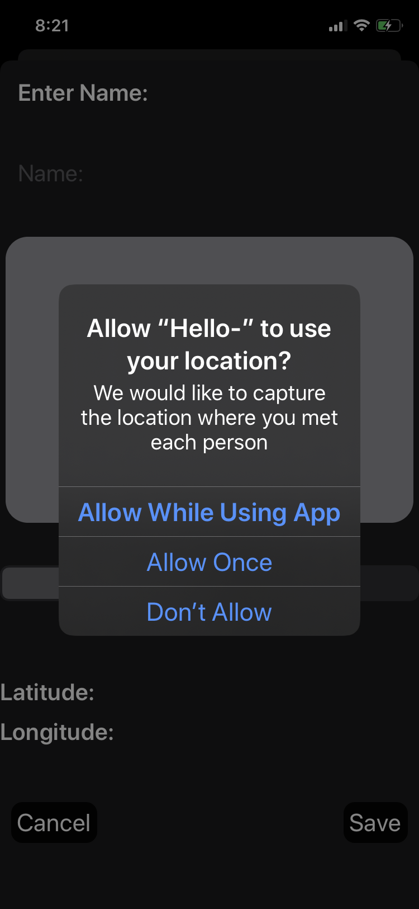
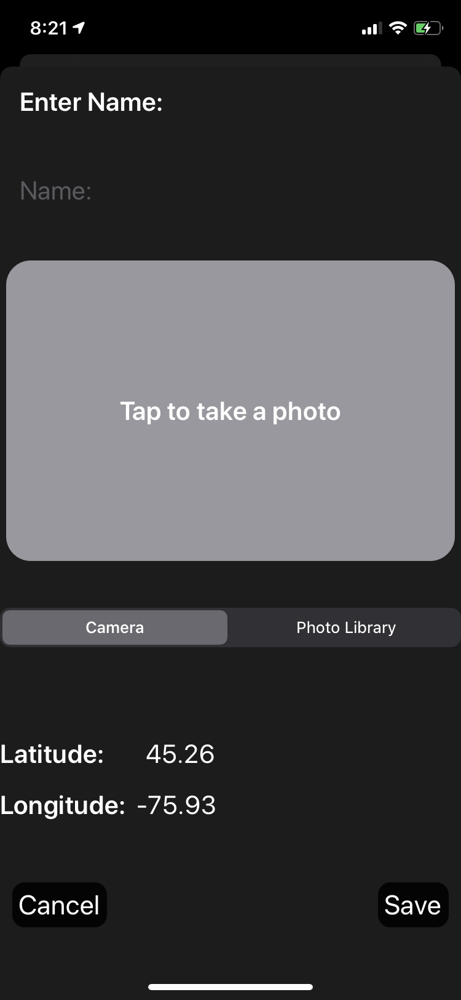
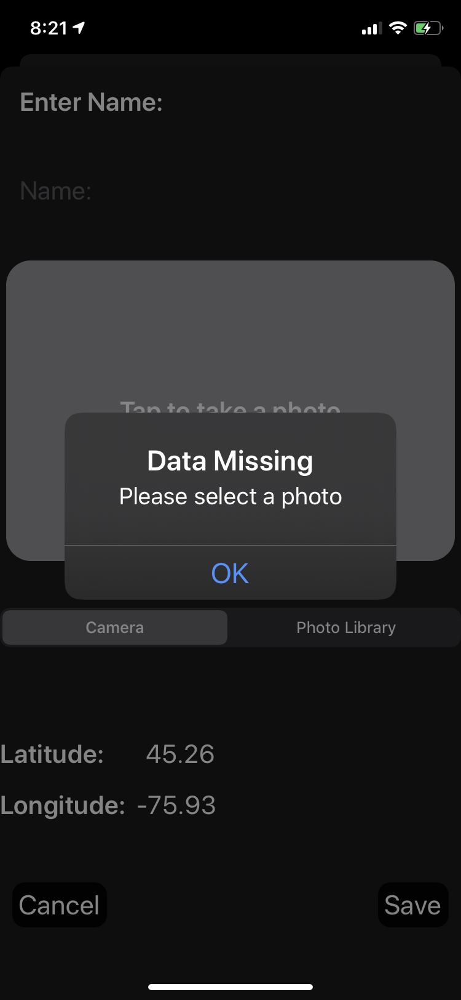
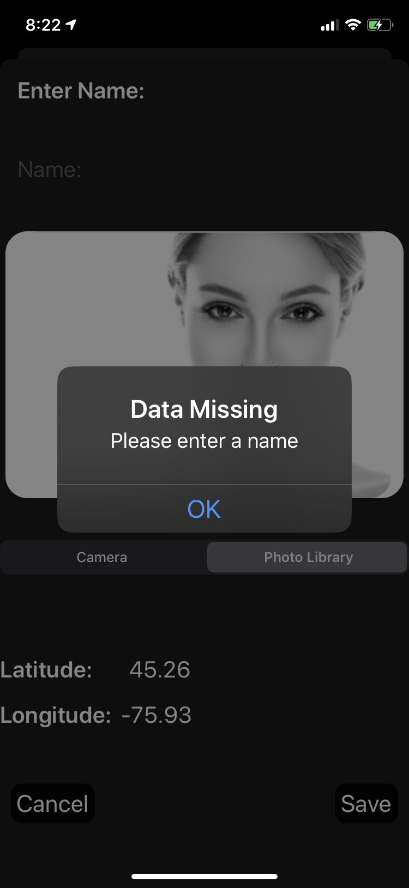
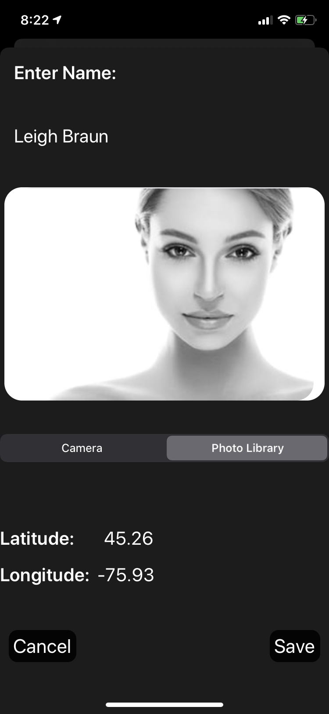

# 100 Days of SwiftUI Project 16

## Hello?

**App Description:**  App that allows the user to save photos of acquaintences and associate a name to the photo.

**Swift Features Used:**
Using the Documents directory to save and retrieve image data, integrating ImagePicker with SwiftUI using UIViewControllerRepresentable, Core Data.

**Screenshots:** teset lowercase png

